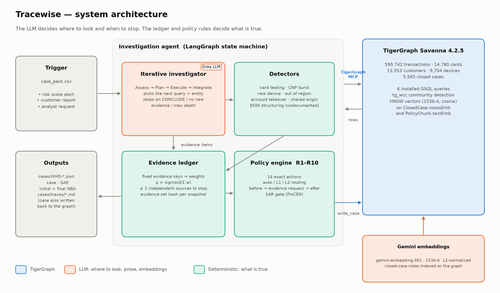
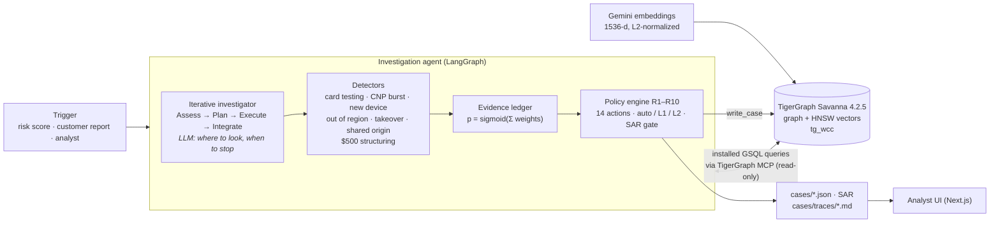
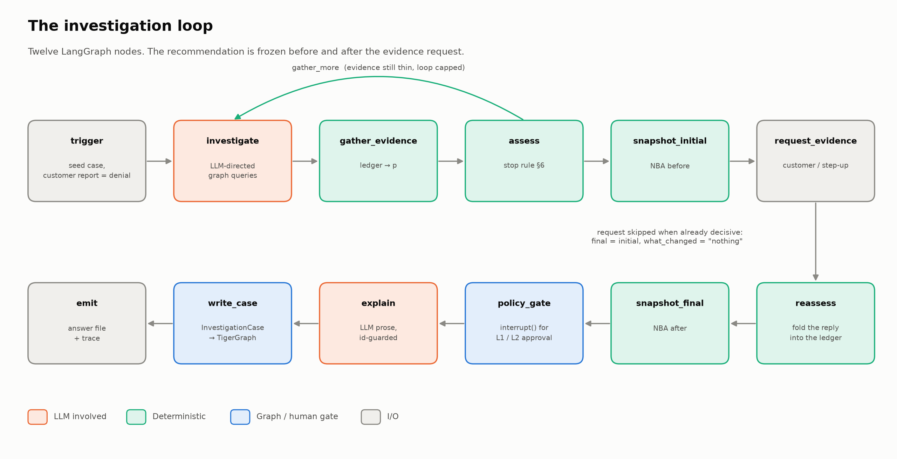
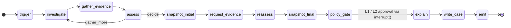
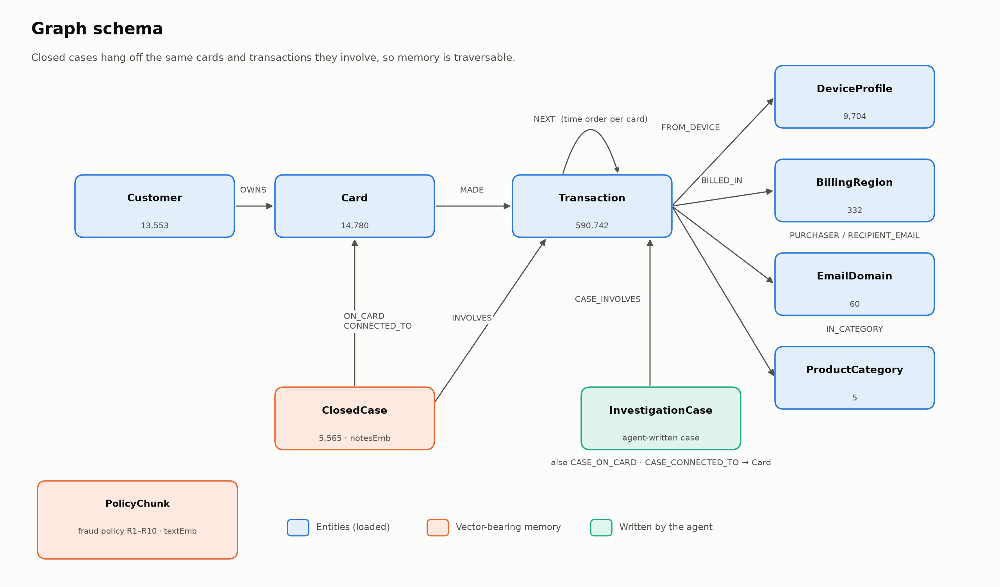
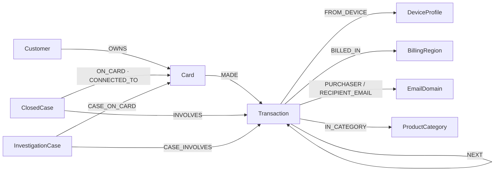
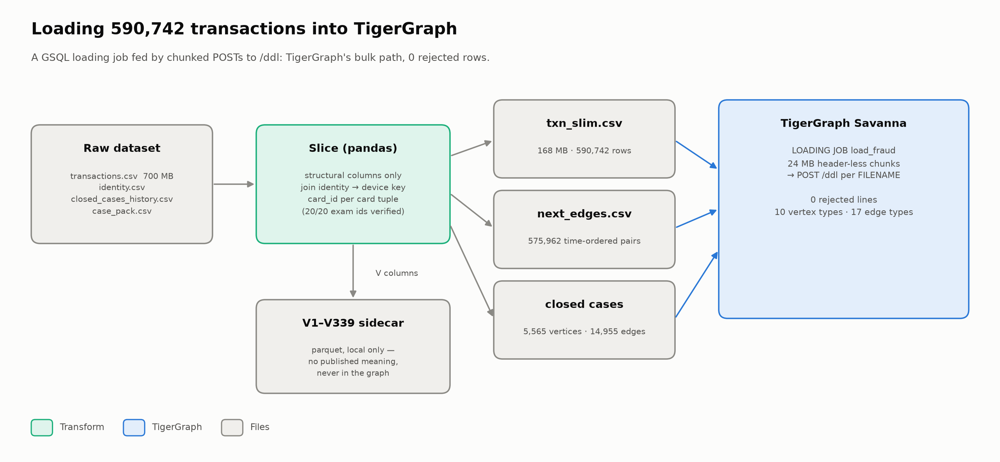
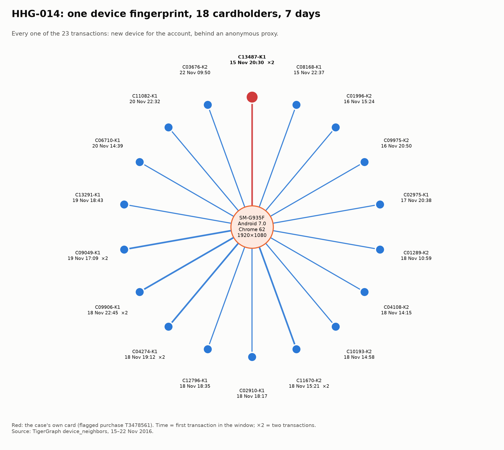
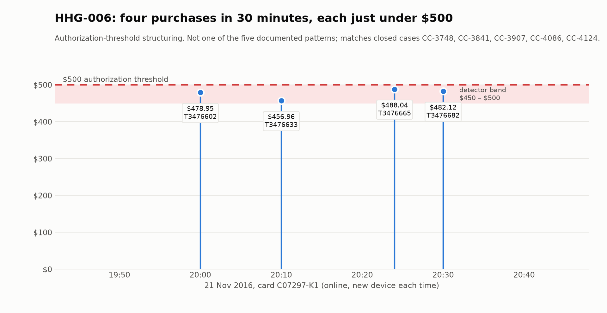
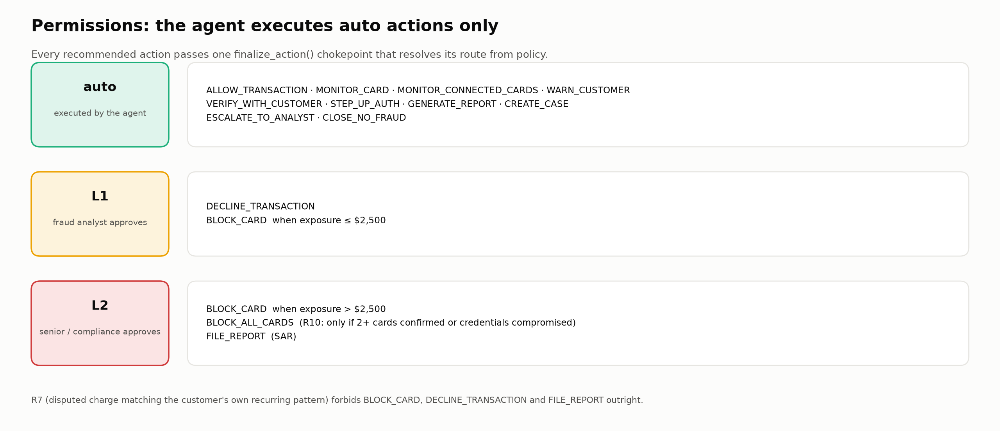

# Tracewise

**An agentic fraud investigator on TigerGraph. It gathers graph evidence, admits
uncertainty, asks for more, and lands on a defensible next-best action.**

Built for the TigerGraph × Hacker House Goa *Agentic Fraud Investigation* hackathon
(IEEE-CIS dataset: 590,742 card transactions, 5,565 closed investigations, 20 benchmark
cases). The organizers' dataset README, fraud policy and answer format are kept verbatim in
[docs/DATASET_README.md](docs/DATASET_README.md).



> **The one rule the whole design follows:** the LLM decides *where to look* and *when to
> stop*. It never decides what is true. Fraud probability comes from a weighted evidence
> ledger, the verdict from fixed thresholds, and the actions from ten numbered policy rules.
> No model token can reach any of them.

---

## What it does

Each case in `case_pack.csv` is triggered by a risk-score alert, a customer report or an
analyst request. For each one, Tracewise:

1. **Investigates on the graph.** An LLM-directed loop picks which precompiled GSQL query to
   run next, and on which entity, through **TigerGraph MCP**. It stops when a pass adds
   nothing new.
2. **Detects patterns.** Six detectors cover the five documented patterns plus shared-origin
   rings. A seventh covers a pattern the labels missed: **$500 authorization-threshold
   structuring**.
3. **Remembers.** GraphRAG over the 5,565 closed cases uses graph traversal *then* HNSW vector
   ranking on `ClosedCase.notesEmb`. Confirmed-fraud and cleared precedent are retrieved as
   **separate pools**, so the 5:1 base rate can't bury the cleared cases.
4. **Admits uncertainty.** It freezes an *initial* next-best action, requests evidence
   (customer validation or step-up auth), folds the reply in, and freezes a *final* one.
   "Uncertain" is a real, creditable answer.
5. **Acts within permissions.** Every action is routed `auto` / `L1` / `L2`. The agent only
   executes `auto`.
6. **Documents.** It writes the answer file, a FinCEN-structured SAR when policy requires one,
   a human-readable trace, and an `InvestigationCase` vertex back into the graph as memory
   for future cases.

---

## Architecture



| Layer | What it is | Where |
|---|---|---|
| Graph + vectors | TigerGraph Savanna 4.2.5: 10 vertex types, 17 edge types, native 1536-d cosine HNSW vectors | [src/graph/schema.gsql](src/graph/schema.gsql) |
| Graph queries | 6 installed GSQL queries + `tg_wcc` community detection | [src/graph/queries.gsql](src/graph/queries.gsql), [src/graph/algorithms.py](src/graph/algorithms.py) |
| MCP | `tigergraph-mcp`, read-only tools; pyTigerGraph fallback with token refresh | [src/graph/mcp.py](src/graph/mcp.py), [src/graph/connection.py](src/graph/connection.py) |
| Agentic loop | LLM-directed query selection with a guarded ad-hoc traversal path | [src/agent/investigator.py](src/agent/investigator.py) |
| State machine | 12-node LangGraph with `interrupt()` approval gate | [src/agent/graph.py](src/agent/graph.py), [src/agent/nodes.py](src/agent/nodes.py) |
| Evidence → decision | Weighted ledger, R1–R10 rule engine, routing chokepoint | [src/policy/](src/policy/), [config/](config/) |
| GraphRAG | Two-pool case memory, policy chunks, Gemini embeddings | [src/rag/](src/rag/) |
| Prose | Groq-written summary + SAR narrative, ID-guarded, template fallback | [src/llm/prose.py](src/llm/prose.py), [src/sar/narrative.py](src/sar/narrative.py) |
| Output contract | Answer schema + validator (20 files, 0 violations) | [src/answer/](src/answer/) |

---

## How one investigation runs





- **`investigate`** is where the agent reasons. It runs a bounded Assess → Plan → Execute →
  Integrate loop, and stops on `CONCLUDE`, on max depth, or when an **evidence fingerprint**
  shows the last query added nothing new. If the LLM is unavailable it says so in
  `stop_reason`. It never quietly runs a fixed script and calls it agentic.
- **`request_evidence`** is enforced in code: if the case can't stop yet, it *must* ask. If
  the case is already decisive, it doesn't ask, and `final == initial`,
  `what_changed == "nothing"`.
- **Ad-hoc GSQL** the model proposes goes through a guard first: a read-only allowlist, a
  DML/DDL keyword blocklist, a 200-row cap and a 20 s timeout. Rejected queries are logged
  as evidence, not hidden.

---

## The graph





Loaded with a GSQL loading job, the bulk path, with **0 rejected rows**:

| Vertices | Count |
|---|---|
| Transaction | 590,742 |
| Card | 14,780 |
| Customer | 13,553 |
| DeviceProfile | 9,704 |
| ClosedCase (with `notesEmb`) | 5,565 |
| BillingRegion / EmailDomain / ProductCategory | 332 / 60 / 5 |



`card_id` isn't in the raw data. It's reconstructed per customer card tuple and anchored on
the bank's known ids, which matches **20/20** exam cases and **4,665/4,665** closed cases.
The 339 unlabeled `V` columns stay in a local parquet sidecar and never enter the graph.

---

## What the graph found

### A device ring (HHG-014)



One browser fingerprint was used by **18 different cardholders in 7 days**. All 23
transactions were new-device and came through an anonymous proxy. A model scoring one
transaction at a time can't see this; a two-hop graph query (`Transaction → DeviceProfile ←
Transaction`) sees it immediately, and `tg_wcc` confirms the community.

Device keys are browser fingerprints: the median key covers 1 customer, the largest 842. So a
ring needs the flagged purchase itself behind an anonymous or hidden proxy, plus at least 3
other customers on the same fingerprint and proxy within the window. Without that, every
"Windows 10 / Chrome" customer would look like a ring member.

### An undocumented pattern (HHG-006)



Reading the nine closed cases labelled `undocumented` by hand turned up a mechanism the labels
had no name for: **several online purchases within the hour, each priced just under $500**,
which is structuring below an authorization threshold. Precedents: CC-3748, CC-3841,
CC-3907, CC-4086, CC-4124. The detector (≥ 3 online purchases, $450–$500, within one hour)
fires on HHG-006.

---

## Guardrails



| Guardrail | How it's enforced |
|---|---|
| LLM never sets probability / verdict / action | Structural: `compute_probability` accepts only ledger keys, and unknown keys raise |
| Only authorized actions execute | One `finalize_action()` chokepoint; `executed = (route == "auto")` |
| Human approval for L1 / L2 | LangGraph `interrupt()` in `policy_gate`, with no side effects above it |
| R7: never block a recurring-charge dispute | Forbids `BLOCK_CARD`, `DECLINE_TRANSACTION`, `FILE_REPORT` |
| No invented IDs in prose | Every ID in LLM output must exist in the input facts, else the template is kept |
| No future leakage | Every graph fetch is bounded by the case's `opened_at` |
| Read-only graph during investigation | MCP `--allowed-tools read-only`; only `write_case` writes |

---

## Results on the 20 benchmark cases

Generated live against TigerGraph. `python -m src.answer.validator cases/` reports **20 files,
0 violations**. Every file records real per-case `tool_calls`, `tokens` and `latency_s`, plus a
readable trace in [cases/traces/](cases/traces/).

| | Count |
|---|---|
| Legitimate | 9 |
| Uncertain | 10 |
| Fraud | 1 |
| SAR filed | 1 (HHG-014) |
| Recommendation changed after the evidence request | 5 |

<details>
<summary>Per-case table</summary>

| Case | Trigger | Verdict | p(fraud) | Pattern | Final actions (route) | SAR |
|---|---|---|---|---|---|---|
| [HHG-001](cases/HHG-001.json) | risk score | legitimate | 0.08 | none | `CLOSE_NO_FRAUD` auto | no |
| [HHG-002](cases/HHG-002.json) | risk score | uncertain | 0.17 | none | `VERIFY_WITH_CUSTOMER` auto, `STEP_UP_AUTH` auto, `MONITOR_CARD` auto, `DECLINE_TRANSACTION` L1 | no |
| [HHG-003](cases/HHG-003.json) | customer report | legitimate | 0.02 | none | `MONITOR_CARD` auto, `CREATE_CASE` auto, `VERIFY_WITH_CUSTOMER` auto, `WARN_CUSTOMER` auto | no |
| [HHG-004](cases/HHG-004.json) | customer report | uncertain | 0.21 | card not present new device | `MONITOR_CARD` auto | no |
| [HHG-005](cases/HHG-005.json) | risk score | legitimate | 0.12 | none | `CLOSE_NO_FRAUD` auto | no |
| [HHG-006](cases/HHG-006.json) | customer report | uncertain | 0.58 | undocumented | `ESCALATE_TO_ANALYST` auto | no |
| [HHG-007](cases/HHG-007.json) | risk score | legitimate | 0.12 | none | `CLOSE_NO_FRAUD` auto | no |
| [HHG-008](cases/HHG-008.json) | customer report | uncertain | 0.33 | card not present new device | `CREATE_CASE` auto, `VERIFY_WITH_CUSTOMER` auto, `WARN_CUSTOMER` auto | no |
| [HHG-009](cases/HHG-009.json) | customer report | legitimate | 0.09 | none | `CREATE_CASE` auto, `VERIFY_WITH_CUSTOMER` auto, `WARN_CUSTOMER` auto | no |
| [HHG-010](cases/HHG-010.json) | risk score | legitimate | 0.12 | none | `CLOSE_NO_FRAUD` auto | no |
| [HHG-011](cases/HHG-011.json) | customer report | uncertain | 0.33 | card not present new device | `CREATE_CASE` auto, `VERIFY_WITH_CUSTOMER` auto, `WARN_CUSTOMER` auto, `ESCALATE_TO_ANALYST` auto | no |
| [HHG-012](cases/HHG-012.json) | risk score | legitimate | 0.12 | none | `CLOSE_NO_FRAUD` auto | no |
| [HHG-013](cases/HHG-013.json) | risk score | uncertain | 0.27 | card not present new device | `MONITOR_CARD` auto | no |
| [HHG-014](cases/HHG-014.json) | analyst request | fraud | 0.61 | undocumented | `MONITOR_CARD` auto, `DECLINE_TRANSACTION` L1, `CREATE_CASE` auto, `FILE_REPORT` L2, `MONITOR_CONNECTED_CARDS` auto | filed |
| [HHG-015](cases/HHG-015.json) | risk score | uncertain | 0.46 | out of region use | `ESCALATE_TO_ANALYST` auto | no |
| [HHG-016](cases/HHG-016.json) | customer report | uncertain | 0.38 | card not present new device | `CREATE_CASE` auto, `MONITOR_CARD` auto | no |
| [HHG-017](cases/HHG-017.json) | risk score | legitimate | 0.08 | none | `CLOSE_NO_FRAUD` auto | no |
| [HHG-018](cases/HHG-018.json) | customer report | uncertain | 0.18 | card not present new device | `CREATE_CASE` auto, `VERIFY_WITH_CUSTOMER` auto, `WARN_CUSTOMER` auto | no |
| [HHG-019](cases/HHG-019.json) | risk score | legitimate | 0.12 | none | `CLOSE_NO_FRAUD` auto | no |
| [HHG-020](cases/HHG-020.json) | risk score | uncertain | 0.27 | card not present new device | `MONITOR_CARD` auto | no |

</details>

---

## Run it

**Requirements:** Python 3.14, a TigerGraph Savanna workspace (4.2+ for vectors), and API
keys for Groq (LLM) and Gemini (embeddings). The dataset CSVs go in `data/` (see
[data/README.md](data/README.md)); they're about 700 MB and never committed.

```bash
uv sync                              # or: python -m venv .venv && pip install -r requirements.txt
cp .env.example .env                 # TG_HOST, TG_GRAPH, TG_SECRET, GROQ_API_KEY, GEMINI_API_KEY

python -m scripts.setup_graph        # schema, graph, vector attributes, install the 6 queries
python -m src.graph.load --data-dir ./data --run-loading-job    # slice + bulk-load (minutes)

python -m src.agent.run --case HHG-017 --data-dir ./data --out cases/
python -m src.agent.run --all --data-dir ./data --out cases/ --evidence-mode agentic
python -m src.answer.validator cases/

python -m pytest tests/ -q           # 181 tests
cd ui && npm install && npm run dev  # analyst UI on http://localhost:3000
```

Useful flags: `--offline` runs from JSON fixtures without TigerGraph; `LLM_PROSE=0` uses the
deterministic templates for summaries and SARs.
`python -m scripts.make_figures` regenerates every image in [docs/images/](docs/images/)
from the loaded data.

---

## Repository layout

```
config/            evidence weights + fraud policy (R1–R10) as YAML: the auditable contract
src/graph/         schema, GSQL queries, loader, MCP bridge, tg_wcc
src/agent/         LangGraph nodes, iterative investigator, live/offline deps, CLI
src/detectors/     pattern detectors (incl. $500 structuring)
src/policy/        evidence ledger + rule engine + routing
src/rag/           embeddings, two-pool retrieval, policy/regulatory chunks
src/llm/ src/sar/  ID-guarded prose, FinCEN-structured SAR
src/answer/        answer-file schema + validator
cases/             the 20 graded answer files + traces/
ui/                Next.js analyst dashboard
docs/              blog, demo script, dataset README, images
handover/          design notes, decisions, gotchas
```

## Further reading

- [docs/BLOG.md](docs/BLOG.md): the technical write-up
- [handover/06-decisions-and-gotchas.md](handover/06-decisions-and-gotchas.md): why things are the way they are
- [docs/DATASET_README.md](docs/DATASET_README.md): dataset, fraud policy, answer format

**Data attribution:** built on the IEEE-CIS Fraud Detection dataset from Vesta Corporation, as
extended by the hackathon organizers. See the attribution section of
[docs/DATASET_README.md](docs/DATASET_README.md).
