# 2. How it works



*(Animated on GitHub — the teal dot traces the evidence loop.)*

## The whole thing in one picture

```
┌─────────────────────────────────────────────────────────────────────────────┐
│  INPUT: one row from case_pack.csv                                          │
│  "HHG-017 | risk_score 0.57 | txn 3450629 | card C04570-K1 | cust C04570"    │
└────────────────────────────────┬────────────────────────────────────────────┘
                                 ▼
        ┌────────────────────────────────────────────────┐
        │  1. INVESTIGATE — ask the graph                │
        │  card_window()      what else on this card?    │
        │  device_neighbours()  who else used this device?│
        │  customer_baseline()  what's normal for them?  │
        │  prior_cases()        seen this before?        │
        └────────────────────────┬───────────────────────┘
                                 ▼
        ┌────────────────────────────────────────────────┐
        │  2. DETECT — six pattern detectors             │
        │  card_testing · cnp_burst · new_device         │
        │  out_of_region · account_takeover · shared_origin│
        │  each returns Finding(pattern, weight_keys, ...)│
        └────────────────────────┬───────────────────────┘
                                 ▼
        ┌────────────────────────────────────────────────┐
        │  3. SCORE — the evidence ledger                │
        │  p = sigmoid(-1.8 + 4.1 × Σ weights)           │
        │  weights live in config/evidence_weights.yaml  │
        └────────────────────────┬───────────────────────┘
                                 ▼
                    ┌────────────────────────┐
                    │  4. CAN WE STOP YET?   │
                    │  p ≥ 0.85 or ≤ 0.15    │
                    │  AND ≥2 evidence pieces│
                    └───┬────────────────┬───┘
                     NO │                │ YES
                        ▼                │
        ┌───────────────────────────┐    │
        │  5. SNAPSHOT: "initial"   │    │
        │  run R1-R10, freeze the   │    │
        │  recommendation as it     │    │
        │  stands right now         │    │
        └───────────┬───────────────┘    │
                    ▼                    │
        ┌───────────────────────────┐    │
        │  6. ASK FOR EVIDENCE      │    │
        │  customer_validation, or  │    │
        │  step_up_auth             │    │
        │  → simulate the reply     │    │
        └───────────┬───────────────┘    │
                    ▼                    │
        ┌───────────────────────────┐    │
        │  7. RE-SCORE              │    │
        │  fold the reply into the  │    │
        │  ledger, recompute p      │    │
        └───────────┬───────────────┘    │
                    ▼                    ▼
        ┌────────────────────────────────────────────────┐
        │  8. SNAPSHOT: "final" — run R1-R10 again       │
        │  THIS IS THE POINT OF THE WHOLE EXERCISE:      │
        │  initial ≠ final, and we can say why           │
        └────────────────────────┬───────────────────────┘
                                 ▼
        ┌────────────────────────────────────────────────┐
        │  9. APPROVAL GATE                              │
        │  auto  → agent executes                        │
        │  L1/L2 → interrupt(), wait for a human         │
        └────────────────────────┬───────────────────────┘
                                 ▼
        ┌────────────────────────────────────────────────┐
        │  10. WRITE                                     │
        │  SAR if policy demands · Case → TigerGraph     │
        │  answer JSON → validate → cases/HHG-017.json   │
        └────────────────────────────────────────────────┘
```

## A real run, with real numbers

This is HHG-017 actually executing today (offline fixtures, verified output):

```
initial   p=0.410   VERIFY_WITH_CUSTOMER(auto)  STEP_UP_AUTH(auto)  DECLINE_TRANSACTION(L1)
                    ── why? card-testing sequence found, but that's one signal and
                       0.41 < 0.70, so R1 says verify before you block

          → evidence request: customer_validation
          → assumed reply: "Customer states they did not make these purchases"

final     p=0.704   BLOCK_CARD(L1)  CREATE_CASE(auto)  DECLINE_TRANSACTION(L1)  STEP_UP_AUTH(auto)
                    ── why? R2: customer denied → block + open a case.
                       Route is L1 because exposure $268 ≤ $2,500
```

**That difference between the two lines is worth 25% of the grade.** It proves the agent
updates its mind under new information instead of deciding once.

## Why a graph and not a table

Three of the five fraud patterns are invisible to a per-transaction model because they live
in the *relationships*:

```
        Customer A                      Customer B
            │                               │
         OWNS│                           OWNS│
            ▼                               ▼
         Card A-K1                       Card B-K2
            │                               │
         MADE│                           MADE│
            ▼                               ▼
    Transaction 1 ──┐               ┌── Transaction 9
                    │               │
              FROM_DEVICE     FROM_DEVICE
                    │               │
                    ▼               ▼
              ┌───────────────────────────┐
              │  DeviceProfile            │  ← two different customers,
              │  "SAMSUNG SM-G935F |      │    same physical device,
              │   Android 7.0 | ..."      │    same week. That's a ring.
              └───────────────────────────┘
```

A model scoring Transaction 1 on its own cannot see Customer B. A two-hop graph query sees
it immediately. Case **HHG-014**'s trigger text is literally an analyst saying *"several
cards this month show purchases from the same unusual device profile"* — that case is
unsolvable without this query, and it's where the Innovation marks are.

## The graph schema

```
   Customer ──OWNS──▶ Card ──MADE──▶ Transaction
                       ▲                  │
                       │                  ├──FROM_DEVICE──▶ DeviceProfile
                  ON_CARD                 ├──BILLED_IN────▶ BillingRegion
                       │                  ├──PURCHASER_EMAIL─▶ EmailDomain
                  ClosedCase              ├──RECIPIENT_EMAIL─▶ EmailDomain
                       │                  ├──IN_CATEGORY──▶ ProductCategory
                  INVOLVES ───────────────┘
                       │                  └──NEXT──▶ Transaction (time-ordered per card)
                       ▼
                  Transaction

   Case ─── same shape as ClosedCase; this is what the agent writes back
   PolicyChunk ─── R1-R10 as vector-indexed text, for citing rules
```

10 vertex types, 14 edge types. The README suggested most of it; we added
`ProductCategory`, `RECIPIENT_EMAIL`, `country_code` on `BillingRegion`, `dist1/dist2`, and
the C/D/M columns as scalars.

## Where the "memory" comes from

The dataset ships **5,565 closed investigations** from July–October — real outcomes,
written by analysts. The 20 exam cases are November–December. So past cases are legitimate
memory, with no leakage.

```
   new alert
       │
       ├──▶ semantic:   embed analyst_notes, cosine similarity      (weight 0.4)
       ├──▶ structural: shared card / device / region via the graph  (weight 0.4)
       └──▶ pattern:    same fraud pattern classification            (weight 0.2)
                         │
                         ▼
           ┌─────────────────────────────┐
           │  TWO SEPARATE POOLS         │
           │  top 3 confirmed_fraud      │  ← precedent that argues FOR fraud
           │  top 2 cleared              │  ← precedent that argues AGAINST
           └─────────────────────────────┘
```

**Why two pools matters:** the history is 4,665 fraud vs 900 cleared. A single merged
top-5 returns five fraud cases almost every time, so the agent only ever sees incriminating
precedent and drifts toward blocking. Pulling the pools separately forces it to see the
cases that say "this looked suspicious and turned out fine."

## What runs where

```
  data/*.csv ──▶ src/graph/load.py ──▶ TigerGraph (Savanna)
                                            ▲
                                            │ GSQL queries via MCP
                                            │
  case_pack.csv ──▶ src/agent/run.py ──▶ LangGraph state machine
                          │                 │
                          │                 ├─▶ src/detectors/   pattern detection
                          │                 ├─▶ src/policy/      rules + probability
                          │                 ├─▶ src/rag/         memory + context
                          │                 └─▶ src/sar/         regulatory narrative
                          ▼
                     cases/*.json ──▶ src/answer/validator.py
                          │
                          └──────────▶ ui/  (Next.js analyst console)
```
